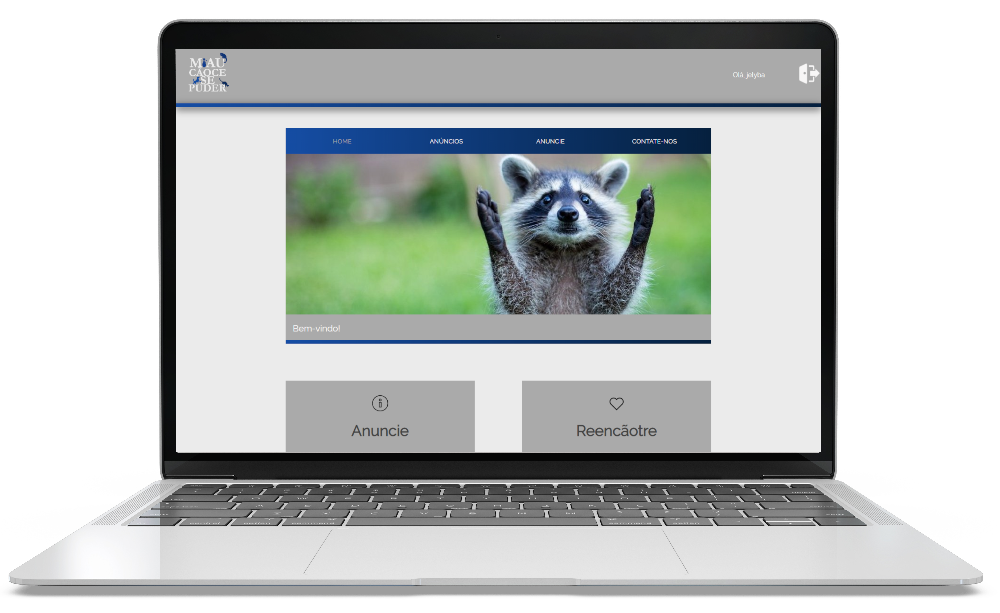

    
    &nbsp;&nbsp;&nbsp;&nbsp;&nbsp;&nbsp;&nbsp;&nbsp;&nbsp;&nbsp;&nbsp;&nbsp;&nbsp;&nbsp;&nbsp;&nbsp;
    

 

	
	&nbsp;
	
	&nbsp;
	
	&nbsp;
	
	&nbsp;
	

 

##### Projeto final do segundo ano do Técnico em Informática Integrado ao Ensino Médio (<a href="http://araquari.ifc.edu.br/">Instituto Federal Catarinense - Campus Araquari</a>).

## Sobre 📖

Com este projeto, visamos apenas proporcionar um portal que possibilite uma comunicação facilitada entre diversos usuários. Com isso, um número cada vez maior de animais abandonados serão tirados da rua, e nossos amigos mascotes finalmente terão um lar. Qualquer dúvida acerca do projeto, acesse a documentação <a href="./documentation/MiauCãoce se Puder.pdf">aqui</a>.

## Autores⚙️

1. <a href="https://github.com/AlemaoProchnow">Cristian Prochnow</a>
2. <a href="https://github.com/UnbreakableEdu">Eduardo Onofre</a>
3. <a href="https://github.com/OthavioMartell">Othávio Martello</a>
